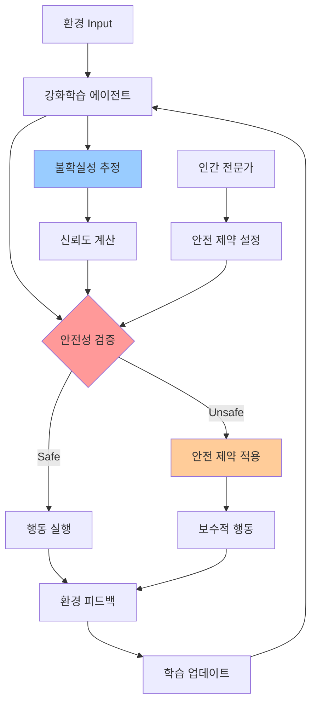
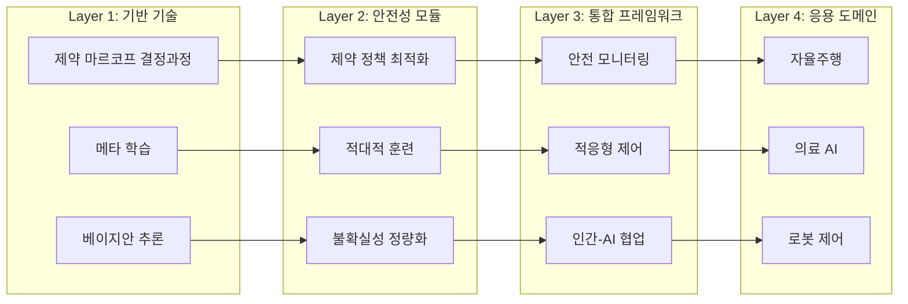
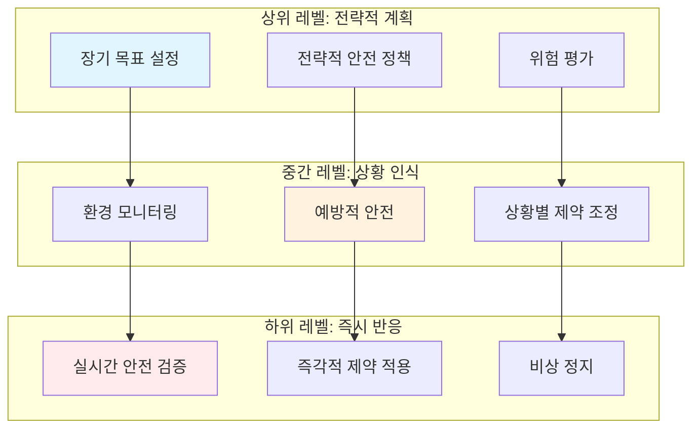
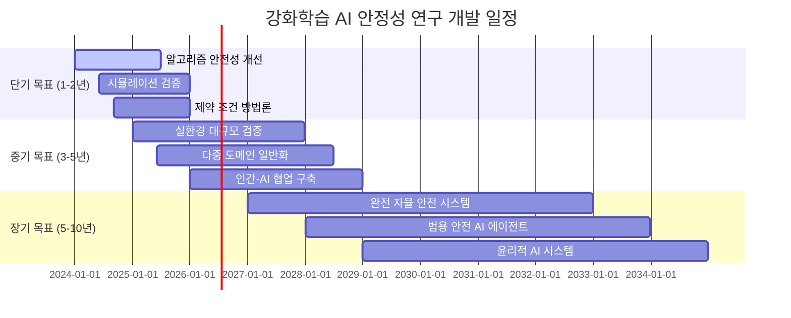
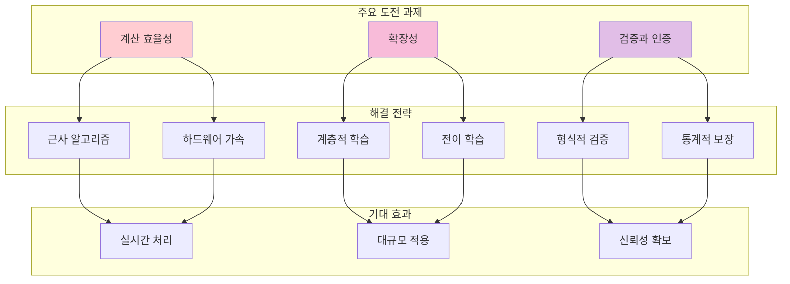

# 강화학습을 통한 AI 모델 안정성 향상: 고도화 연구 방향
(.with claude-code)
## 개요
본 문서는 강화학습(Reinforcement Learning, RL)을 활용하여 AI 모델의 안정성과 견고성을 높이는 최신 연구 동향과 고도화 방향을 제시합니다. 2024-2025년 최신 연구를 바탕으로 실용적이고 안전한 AI 시스템 구축을 위한 핵심 기술들을 소개합니다.

## 전체 시스템 아키텍처

## 핵심 기술 스택 구조

## 1. 현재 연구 동향과 핵심 도전 과제

### 1.1 주요 연구 영역
- **안전 강화학습(Safe RL)**: 성능 최적화와 안전성 제약 조건의 균형
- **견고한 강화학습(Robust RL)**: 환경 변화와 적대적 공격에 대한 내성
- **분포 강건성(Distributional Robustness)**: 훈련-테스트 환경 간 분포 차이 극복
- **제약 최적화(Constraint Optimization)**: 명시적 안전 제약 하에서의 정책 학습

### 1.2 현실 배포의 핵심 도전 과제
- **환경 불확실성**: 실제 환경과 시뮬레이션 환경 간의 차이
- **분포 이동(Distribution Shift)**: 훈련 데이터와 실제 데이터의 분포 불일치
- **안전성 보장**: 탐험 과정에서의 안전 제약 준수
- **일반화 능력**: 새로운 상황에서의 정책 성능 유지

## 2. 고도화를 위한 핵심 기술 영역

### 2.1 제약 기반 안전 강화학습
**핵심 개념**: 제약 마르코프 결정 과정(Constrained MDP) 기반의 안전한 정책 학습

**주요 접근법**:
- **제약 정책 최적화(CPO)**: 보상 최대화와 안전 제약 만족의 동시 달성
- **조건부 제약 정책 최적화(CCPO)**: 다양한 안전 임계값에 대한 적응형 학습
- **CVaR 제약**: 기댓값뿐만 아니라 분포의 꼬리 위험까지 고려한 안전성 보장

**고도화 방향**:
- 실시간 제약 조건 적응
- 다중 제약 조건 하에서의 최적화
- 불확실한 제약 조건에 대한 견고성

### 2.2 적대적 훈련과 견고성
**핵심 개념**: 적대적 환경에서의 견고한 정책 학습

**주요 기술**:
- **견고한 적대적 강화학습(RARL)**: 교란 세력에 대한 내성 구축
- **인구 기반 적대적 훈련**: 다양한 적대자를 통한 견고성 향상
- **분포적 적대적 훈련(ADT)**: 최악의 경우 분포에 대한 minimax 최적화

**고도화 방향**:
- 적응형 적대자 설계
- 다중 모달 적대적 공격에 대한 방어
- 실시간 적대적 환경 감지 및 대응

### 2.3 불확실성 추정과 위험 인식
**핵심 개념**: 모델 불확실성을 명시적으로 고려한 의사결정

**주요 접근법**:
- **베이지안 강화학습**: 사후 분포를 통한 불확실성 정량화
- **앙상블 방법**: 다중 모델을 통한 예측 신뢰도 향상
- **분포 강화학습**: 값 함수의 전체 분포 학습

**고도화 방향**:
- 인식적 불확실성과 우연적 불확실성의 분리
- 온라인 불확실성 추정
- 불확실성 기반 적응형 탐험

### 2.4 메타 학습과 일반화
**핵심 개념**: 빠른 적응과 새로운 환경에서의 일반화

**주요 기술**:
- **모델 불가지론적 메타학습(MAML)**: 빠른 적응을 위한 초기화 최적화
- **맥락 내 학습(In-Context Learning)**: 새로운 작업에 대한 즉시 적응
- **도메인 적응**: 도메인 간 지식 전이

**고도화 방향**:
- 평생 학습 시스템
- 멀티태스크 안전 학습
- 연속적 도메인 적응

## 3. 실용적 고도화 전략

### 3.1 하이브리드 접근법
**제어 이론 통합**:
- 강화학습과 고전 제어 이론의 융합
- 안전성 보장을 위한 제어 이론적 백업 정책
- 학습된 정책의 안정성 증명

**모델 기반 + 모델 무관 결합**:
- 초기 안전 탐험을 위한 모델 기반 접근
- 성능 최적화를 위한 모델 무관 미세 조정
- 불확실성 영역에서의 보수적 행동

### 3.2 계층적 안전 아키텍처

**다층 안전 시스템**:
- **상위 레벨**: 장기적 목표와 안전성의 전략적 균형
- **중간 레벨**: 상황 인식 기반 예방적 안전
- **하위 레벨**: 즉각적 안전 제약 (반응적 안전)

**모듈식 설계**:
- 안전 모니터링 모듈
- 적응형 제약 조정 모듈
- 비상 개입 시스템

### 3.3 인간-AI 협업 프레임워크
**인간 피드백 통합**:
- 인간 전문가의 안전 지침 통합
- 실시간 인간 개입 메커니즘
- 설명 가능한 AI를 통한 투명성 확보

**점진적 자율성**:
- 단계적 자율성 증가
- 성능 기반 신뢰도 조정
- 동적 인간-AI 역할 분담

## 4. 분야별 적용 방향

### 4.1 자율주행 시스템
- **안전 임계 시나리오 대응**: 비상 상황에서의 안전한 행동 학습
- **멀티 에이전트 협조**: 다른 차량 및 보행자와의 안전한 상호작용
- **날씨/환경 적응**: 다양한 환경 조건에서의 견고한 성능

### 4.2 의료 AI 시스템
- **환자 안전 최우선**: 치료 권장 시 안전성 제약 엄격 적용
- **불확실성 관리**: 의학적 불확실성 하에서의 보수적 의사결정
- **개인화**: 환자별 특성을 고려한 적응형 치료 계획

### 4.3 로봇 시스템
- **물리적 안전**: 인간과의 상호작용에서 물리적 위험 최소화
- **동적 환경 적응**: 예측 불가능한 환경 변화에 대한 실시간 대응
- **작업 연속성**: 안전성을 유지하면서 작업 효율성 극대화

## 5. 연구 개발 로드맵

### 5.1 단기 목표 (1-2년)
- 기존 알고리즘의 안전성 개선
- 시뮬레이션 환경에서의 견고성 검증
- 제약 조건 설계 방법론 확립

### 5.2 중기 목표 (3-5년)
- 실제 환경에서의 대규모 검증
- 다중 도메인 일반화 기술 개발
- 인간-AI 협업 프레임워크 구축

### 5.3 장기 목표 (5-10년)
- 완전 자율 안전 시스템 구현
- 범용 안전 AI 에이전트 개발
- 사회적 영향 고려한 윤리적 AI 시스템

## 6. 기술적 도전과 해결 방향

### 6.1 계산 효율성
**문제**: 안전성 고려 시 계산 복잡도 증가
**해결책**: 
- 근사 알고리즘 개발
- 하드웨어 가속 기술 활용
- 효율적 샘플링 기법

### 6.2 확장성
**문제**: 고차원 상태/행동 공간에서의 성능 저하
**해결책**:
- 계층적 강화학습
- 함수 근사 기법 개선
- 전이 학습 활용

### 6.3 검증과 인증
**문제**: 안전 임계 시스템의 성능 보장 증명
**해결책**:
- 형식적 검증 방법 개발
- 통계적 안전성 보장
- 단계적 검증 프로세스

## 결론

강화학습을 통한 AI 모델 안정성 향상은 안전성, 견고성, 일반화 능력의 통합적 접근이 필요한 복합적 과제입니다. 제약 기반 학습, 적대적 훈련, 불확실성 추정, 메타 학습 등의 핵심 기술을 체계적으로 결합하고, 실용적 검증을 통해 점진적으로 발전시켜야 합니다.

특히, 인간-AI 협업 관점에서 투명성과 설명가능성을 확보하면서도 높은 성능을 달성하는 것이 향후 연구의 핵심 방향이 될 것입니다. 이러한 기술적 진보를 통해 실제 세계에서 안전하고 신뢰할 수 있는 AI 시스템을 구축할 수 있을 것으로 기대됩니다.